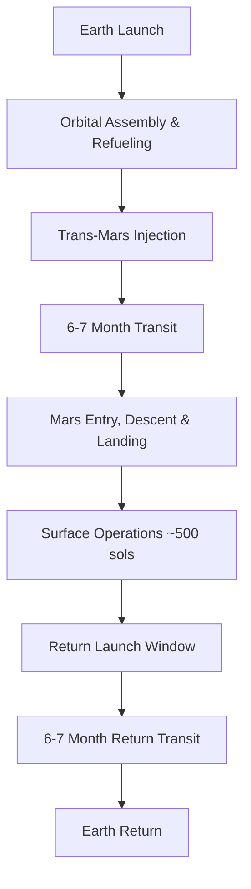
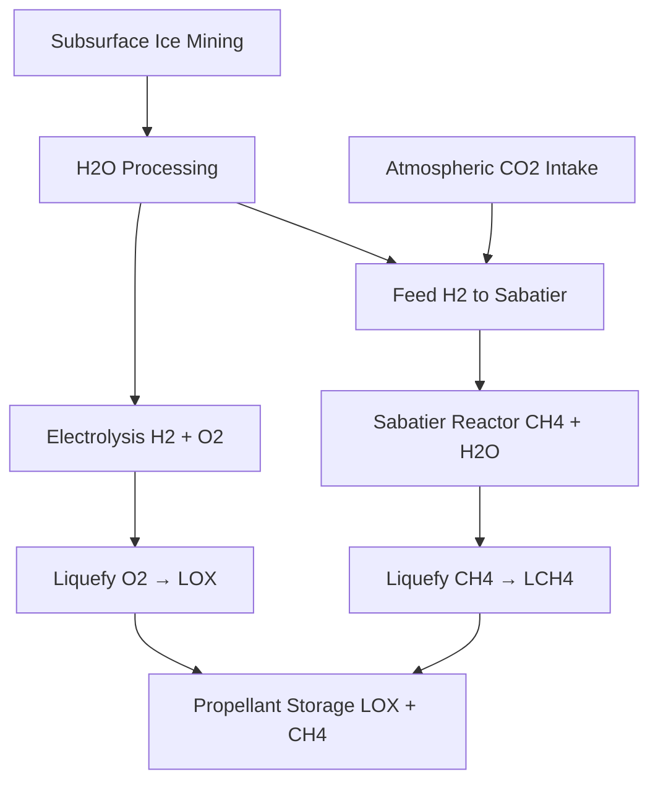

# Detailed Feasibility Assessment: Establishing a Mars Base at Arcadia Planitia

*Comprehensive analysis combining transportation architecture, surface systems, and colonization roadmap*

---

## 1. Executive Summary

Humanity's first foothold on Mars is technically within reach by the 2030s, driven by rapid advances in launch systems, in‑situ resource utilization (ISRU), and habitat technology. SpaceX's fully reusable **Starship/Super Heavy** rocket – the most powerful ever built – is central to this vision. After a series of suborbital and orbital test flights (with a 10th test flight slated for early August 2025), Starship is nearing the capability to deliver >100 tons per flight to Mars. Key developments such as orbital refueling and heavy-lift launch cadence are progressing: SpaceX has executed 81 orbital launches in the first half of 2025 alone, and Elon Musk projects eventually launching _"1,000 to 2,000 ships to Mars every two years"_ once the system is mature.

This report presents an in-depth analysis of the end-to-end endeavor of getting to Mars and living there. It focuses on the proposed **base at Arcadia Planitia** – a flat northern plains region rich in subsurface ice – while comparing it to other candidate sites. We examine the transportation architecture (launch, transit, landing), the design of surface systems (power, ISRU propellant production, habitats, life support), and the timeline for development from initial missions to a sustained settlement. Four mission-critical pillars emerge: **(1)** high-cadence reusable launch to affordably send mass to Mars, **(2)** reliable **orbital refueling** to enable those large payloads, **(3)** robust **ISRU** (production of oxygen, water, and fuel from Martian resources), and **(4)** survivable **surface infrastructure** (power, radiation shielding, habitats). Recent demonstrations – e.g. NASA's MOXIE experiment making oxygen from Martian CO₂ – bolster confidence that these capabilities can be realized.

**Feasibility:** With aggressive technology maturation, a first crewed Mars landing by ~2033 is achievable under an optimistic schedule (SpaceX aims for an uncrewed Starship landing in 2026). A sustainable outpost of ~100 people could follow by the late 2030s if systems are iterated rapidly and launch costs drop as expected. More conservative timelines place the first human mission in the late 2030s or 2040s. **In summary,** establishing a human settlement on Mars is _possible_ within two decades – but only if the next few years are used to flight-prove Starship, validate Mars ISRU at scale, and start delivering the components of an initial base to the Red Planet.

---

## 2. Why **Arcadia Planitia**? – Site Selection Rationale

Choosing the right landing site on Mars is crucial for long-term survival. **Arcadia Planitia** is a strong frontrunner due to its unique blend of safety and resource advantages:

### Resource Advantages

- **Abundant Water Ice:** Arcadia Planitia contains a vast reservoir of near-surface water ice. Studies of expanded impact craters and radar soundings indicate **≥6,000 km³** of ice is buried under thin soil here – enough water to form a **global** 4 cm layer if spread over Mars. This "excess ice" lies roughly 5–15 m below ground, preserved from an earlier climate. Water is an indispensable resource: it can be melted for drinking and hydration, split into oxygen for breathing and oxidizer, and combined with atmospheric CO₂ to produce methane fuel.

- **Flat, Safe Terrain:** Arcadia Planitia is a relatively flat plain centered at ~47°N, 184°E, with smooth lava flows and very few steep slopes. The elevation is around –2 to –3 km relative to Mars's datum, meaning thicker atmosphere above to aid braking. SpaceX-led analyses found that areas in southern Arcadia Planitia offer **<5° slopes** and a low probability of large rocks, meeting the requirement that <5% of terrain has boulders >1 m high.

- **Near-Optimal Latitude:** At ~40–45°N, Arcadia Planitia strikes a balance between resource access and solar energy. The latitude provides decent sunlight for solar arrays while avoiding the extreme cold of the poles and maintaining access to subsurface ice resources.

### Comparison with Alternative Sites

| Site | Latitude | Advantages | Disadvantages |
|------|----------|------------|---------------|
| **Arcadia Planitia** | ~45°N | Abundant ice, flat terrain, balanced solar | Reduced solar vs equatorial |
| **Elysium Planitia** | ~4°N | Excellent solar, flat | Poor water resources |
| **Utopia Planitia** | 30-50°N | Massive ice sheet | Ice deeper, harder protective layer |
| **Phlegra Montes** | ~30°N | Better solar, glacial ice | More rugged terrain, limited flat areas |

---

## 3. Transportation Architecture – Getting to Mars

The transportation system represents the foundation of Mars colonization capability. SpaceX's architecture is currently the most developed approach:

### Earth Launch & Booster Reuse

SpaceX's **Super Heavy** booster provides the muscle to escape Earth with 33 **Raptor** engines producing ~7,500 tonnes of thrust at liftoff. After lifting the Starship upper stage toward orbit, the booster returns to the launch site for rapid reuse. **Launch cadence** is critical: SpaceX aims for each booster to fly dozens of times per year, achieving the tempo needed for Mars campaigns requiring 5–10 launches per crewed mission.

### Starship Spacecraft

**Starship** serves as the combined upper stage, deep-space vehicle, and lander. Fully fueled in Earth orbit, a Starship can send ~100–150 t of payload to Mars. The craft includes:
- 6 Raptor engines (3 for landing, 3 for vacuum operations)
- Robust steel airframe with active heat-shield tiles
- ~1,000 m³ of pressurized volume
- Closed-loop life support for 6–8 astronauts on early missions

### Orbital Refueling & Depots

A cornerstone of the SpaceX plan is **in-orbit refueling** of Starships. Since sending 100 t to Mars requires ~1,000 t of propellant, multiple **tanker Starships** must rendezvous and transfer propellants in Earth orbit. Each tanker can carry ~100 t of methane and oxygen, requiring 5–8 tanker flights per Mars ship.

### Mission Profile



---

## 4. Entry, Descent and Landing (EDL) at Mars

Getting a large spacecraft safely onto the Martian surface pushes into uncharted territory for vehicles as massive as Starship:

### Aerodynamic Entry

Starship will approach Mars atmosphere at about 7.5 km/s, performing **aero-braking** using its heat shield tiles. Unlike blunt capsules, Starship uses a lifting body profile, entering oriented nearly horizontal ("belly-first") to generate drag while maintaining some steering capability through deployable body flaps.

### Supersonic Retropropulsion

Mars has no parachute option for something this heavy. Instead, Starship will perform **supersonic retropropulsive descent**, pitching vertically and igniting Raptor engines while still moving at supersonic speed. The vehicle will be guided by onboard LiDAR/radar for terrain mapping in the final kilometers.

### Landing Pad Preparation

One crucial lesson from Starship testing is the destructive power of engine plumes on unprepared ground. Therefore, **preparing a landing zone** in advance is highly desirable through:
- Autonomous bulldozer and **sintering robots** clearing and grading the area
- **Microwave sintering** of regolith into hard surface crust
- **Berms** around the pad to contain exhaust plume

---

## 5. Surface Systems & In‑Situ Resource Utilization (ISRU)

Upon landing, the crew must transform Mars into a livable outpost through "living off the land" via ISRU:

### Water Extraction

All life support and fuel production begins with **water** from subsurface ice deposits. The extraction process involves:
- **Heated drill/auger mining rigs** penetrating icy soil
- **Reverse sublimation** capture systems
- Target production: **1 metric ton of water per day**

### Oxygen Production (Atmospheric ISRU)

Mars' atmosphere is ~95% CO₂, from which oxygen can be extracted via electrochemical processes. The **MOXIE** experiment proved this concept at small scale. For a crewed base:
- Scale up to **2-3 kg O₂ per hour** continuous output
- Target: **~230 t of liquid oxygen (LOX)** per Starship return launch
- Process: Atmospheric intake → compression → dust removal → solid oxide electrolysis

### Methane Fuel Production (Sabatier Reactor)

Rocket propellant requires **methane (CH₄)** fuel produced via the **Sabatier reaction**:
```
CO₂ + 4H₂ → CH₄ + 2H₂O
```
- Input: CO₂ from atmosphere + H₂ from water electrolysis
- Output: Methane + water (recycled)
- Target: **~15-20 t of liquid methane** per Starship return

### ISRU Flow Diagram



### Power Systems

The base requires reliable power for all operations:

**Solar Energy:**
- At Arcadia Planitia (~45°N): ~110 W per m² average insolation
- For 1 MW continuous power: ~33,000 m² of panels required
- Challenges: dust accumulation, seasonal variation, dust storms

**Nuclear Power:**
- Small fission reactors (1-100 kW range) for baseline power
- Advantages: weather-independent, compact, steady output
- Concepts: Kilopower reactors, small modular reactors

**Hybrid Approach:**
- Solar farms for primary power during good conditions
- Nuclear backup for dust storms and critical systems
- Energy storage: batteries, regenerative fuel cells

---

## 6. Habitats & Civil Engineering

Mars settlement will evolve through distinct phases, each with different habitat solutions:

### Phase 0: Pre-deployment and Starship Habitats (late 2020s–early 2030s)

- Uncrewed cargo Starships land first with equipment and supplies
- Crewed Starship serves as initial habitat (~100 m³ livable space)
- Temporary surface shelters: inflatable domes, pressurized rovers

### Phase 1: Surface Base with Shielded Modules (2030–2035)

- **Buried habitats under regolith** for radiation protection
- **Hard shell modules** or repurposed Starship tanks
- ~2 meters of regolith provides 150 g/cm² areal density shielding
- Connected by pressurized tunnels
- Supports ~20-30 astronauts

### Phase 2: Going Underground (2035 onward)

- **Subsurface habitats** in excavated tunnels or natural lava tubes
- Modified **Boring Company** tunnel boring machines
- Underground chambers with >5 m rock overhead
- **Honeycomb** living spaces connected by elevator shafts

### Construction Materials

- **Mars concrete:** sulfur mixed with regolith
- **Sintered bricks:** heated/compressed regolith
- **Ice construction:** frozen water as building material
- **3D printing:** autonomous printing of structures before crew arrival

### Radiation and Environmental Protection

- Target: Reduce exposure from ~0.2 Sv/yr to ~0.02-0.05 Sv/yr
- Methods: Thick regolith, water shielding, underground habitats
- Micrometeorite protection: Multi-layer walls, self-sealing liners
- Pressure management: Strong pressure vessels, soil buttressing

---

## 7. Life Support, Life on Mars, and Crew Welfare

### Environmental Control and Life Support System (ECLSS)

**Atmosphere Management:**
- Breathable atmosphere: ~21% O₂, 78% N₂, 1% Ar/CO₂
- CO₂ removal via scrubbers and Sabatier recycling
- Oxygen replenishment from ISRU and internal recycling

**Water Recycling:**
- ~90% water recovery from all sources (humidity, urine, wash water)
- Backup supply from mined Martian ice
- Multifiltration and distillation systems

**Waste Management:**
- Solid waste processing in bioreactors
- Methane biogas and fertilizer production
- Recycling of plastics and materials

### Food and Agriculture

**Timeline and Scale:**
- **Initial missions:** Pre-packaged food from Earth + small hydroponics (~10 m²)
- **Medium term (2030-2035):** Larger greenhouses (~50 m² per person)
- **Settlement scale:** Underground growing chambers, diverse crops

**Growing Methods:**
- **Hydroponics/Aeroponics:** Soil-free, nutrient solution-based
- **Processed Mars regolith:** After perchlorate removal
- **Protein sources:** Insects, spirulina algae, mushrooms

**Power and Light:**
- Hybrid natural sunlight + LED supplementation
- Solar concentrators for underground growing
- ~200 W per m² for strong artificial growth lighting

### Health and Medical Care

**Radiation Management:**
- Habitat shielding reduces GCR dose to ~50 mSv/year
- Storm shelters for solar particle events
- Pharmaceuticals and free radical scavengers

**Partial Gravity (0.38g):**
- Daily exercise regimen: treadmills, resistance training
- Potential bone/muscle loss mitigation
- Possible centrifuge facilities for higher-g exposure

**Medical Facilities:**
- Crew member with extensive medical training
- Telemedicine support from Earth (10-20 minute delay)
- Portable ultrasound, basic lab equipment, surgical tools
- Stock of critical medications and antibiotics

**EVA Operations:**
- Advanced planetary suits with dust mitigation
- Rear-entry "suitport" design to prevent contamination
- Redundant life support and thermal control

---

## 8. Communications & Navigation

### Deep Space Link to Earth

- **Mars Internet constellation:** "Starlink for Mars" or "Marslink"
- High-frequency/laser links for terabit data transmission
- 4-24 minute one-way latency depending on orbital positions
- Backup during solar conjunction periods

### Mars Orbital Network

- Constellation providing ~20 Mbps surface coverage
- Integration with existing Mars orbiters (MRO, MAVEN)
- Redundancy through multiple satellites

### Surface Communications

- Local Wi-Fi/VHF/UHF networks within base
- Repeaters and relay beacons for extended range
- Comm drones for rover expeditions

### Navigation Systems

- Mars GPS constellation using navigation satellites
- Local reference beacons around landing sites
- Inertial navigation and terrain mapping backup
- High-resolution orbital maps for surface operations

---

## 9. Colonization Roadmap: Phases of Development

### Phase 0: Earth-Side Foundations (2025-2026)

| Objective | Key Elements | Milestones |
|-----------|--------------|------------|
| **Starship production ramp** | SpaceX Starship & Super Heavy | 1,000 Starships/yr production goal |
| **Orbital refueling** | Tanker & depot architecture | Multi-ship propellant transfer demo |
| **Cargo manifests** | Optimus robots, solar farms, ISRU | First uncrewed flights validate EDL |
| **Comms architecture** | Marslink constellation design | High-bandwidth Earth-Mars relay |

### Phase I: Earth Departure & Transit (2026-2029)

1. **Vehicle Integration & Launch**
   - Super Heavy boosters from Starbase, TX
   - Rapid turnaround with stainless steel airframes

2. **Orbital Refueling & Tanker Rendezvous**
   - Up to 8 tanker flights per Mars ship
   - AI-managed depot operations

3. **Trans-Mars Cruise (~6 months)**
   - Water-wall radiation shielding
   - Autonomous maintenance via Optimus robots

### Phase II: Initial Surface Operations (2028-2031)

| Task | Implementation | Rationale |
|------|----------------|-----------|
| **Landing & Site Survey** | Precision landing at 45°N, 195°E | Flat terrain, accessible ice |
| **Robotic Deployment** | Optimus robots deploy infrastructure | Eliminates early EVA overhead |
| **Power & Comms** | 50 MW solar + storage, Marslink | Round-the-clock operations |
| **Surface Mobility** | Pressurized rovers and vehicles | Extended exploration capability |

### Phase III: Habitat Construction (2030-2035)

**Subsurface Development:**
- Boring Company tunnel-boring machines
- Spiral access ramps to ≥20 m depth
- Regolith provides ≥15 g/cm² radiation shielding

**Infrastructure:**
- Hybrid tunnel-inflatable modules
- Regolith-derived concrete lining
- 750 mbar CO₂/N₂ mix pressurization

**Life Support:**
- Sabatier reactors for propellant and water
- Closed-loop hydroponics
- Myco-architecture biomaterials

### Phase IV: Toward Self-Sufficiency (2035-2045)

1. **Industrial Scale-Up**
   - Expand to 500 MW power capacity
   - Small modular nuclear reactors

2. **Agriculture & Food Security**
   - Layered vertical farms
   - Waste heat utilization for greenhouses

3. **Local Manufacturing**
   - Gigafactory-Mars for spare parts
   - Refined regolith alloy production

4. **Governance & Law**
   - Outpost charter development
   - Blockchain-secured governance systems

### Phase V: City-Scale Expansion (mid-2040s+)

| Population | Infrastructure |
|------------|----------------|
| **10,000** residents | Multiple districts, dual runways, hospital/university |
| **100,000** residents | Terraforming research, ice-cap rail, Utopia hub connection |
| **1,000,000** residents | Closed-loop systems, indigenous industry, self-governance |

---

## 10. Risk Matrix and Mitigations

| Risk Category | Specific Risks | Mitigations & Contingencies |
|---------------|----------------|----------------------------|
| **Launch/Launch Pad** | Launch failure, booster explosion | Thorough testing, crew escape systems, multiple vehicles |
| **In-Space Transit** | Micrometeoroid damage, solar flares, life support failure | Hull shielding, storm shelters, redundant systems |
| **Mars EDL** | Heat shield failure, engine failure, hazardous terrain | Proven materials, engine-out capability, site preparation |
| **Surface ISRU** | Water extraction issues, dust contamination, power shortage | Prospecting, robust filtering, nuclear backup power |
| **Human Factors** | Medical emergency, psychological breakdown, reduced gravity | Medical training, telemedicine, exercise regimens |
| **Technology** | System breakdown, fire hazard | Redundancy, spare parts, fire suppression systems |
| **Logistics** | Supply interruption, political support | Pre-positioning, local manufacturing, diversified funding |

---

## 11. Cost & Schedule Outlook

### Development Timeline

| Milestone | Year | Cumulative Cost (USD B) |
|-----------|------|------------------------|
| **First uncrewed cargo** | 2026-2028 | $6-10 B |
| **ISRU & power demo** | 2028-2030 | $25 B |
| **First crewed mission** | 2030-2033 | $40 B |
| **100-person outpost** | 2035 | $80 B |
| **Self-sustaining colony** | 2040+ | $150+ B |

### Cost Factors

- **Starship operations:** ~$50M per flight (optimistic)
- **Development amortization:** Spread across multiple missions
- **International cost-sharing:** NASA, ESA, other agencies
- **Learning curve reductions:** Economics of scale

### Return on Investment

- **Intangible benefits:** Prestige, knowledge, species survival
- **Technology spinoffs:** Closed-loop systems, robotics, AI
- **Future economic potential:** Martian resources, tourism, research

---

## 12. Technology Integration: The Musk Stack

| Company/Technology | Critical Contribution |
|-------------------|----------------------|
| **SpaceX Starship** | High-cadence transport of ≥150 t cargo |
| **Tesla** | Cybertruck rovers, Optimus robots, energy systems |
| **Boring Company** | Automated tunnel boring for radiation-shielded habitats |
| **Starlink/Marslink** | Planet-wide high-bandwidth communications |
| **xAI Grok** | Autonomous mission control and predictive maintenance |

This integrated technology stack provides synergistic capabilities uniquely positioned to enable Mars colonization within two decades.

---

## 13. Conclusions & Recommendations

Establishing a human settlement on Mars is **feasible** but requires orchestrated advancement on multiple technological fronts. Arcadia Planitia emerges as the optimal site for humanity's first permanent off-world base, combining safety, resources, and expansion potential.

### Critical Success Factors

1. **Orbital Refueling Demonstration** by late 2020s
2. **Mars ISRU Scaling** from grams to tons per day
3. **Multi-megawatt Power Solutions** for industrial operations
4. **Long-duration Life Support Testing** in Mars-analog conditions
5. **Phased Approach** with clear go/no-go checkpoints

### Recommended Next Steps (2025-2030)

1. **Achieve ≥5 successful Starship orbital flights** with reuse demonstration
2. **Send automated precursors** to validate EDL and ISRU systems
3. **Establish international cooperation** for cost and risk sharing
4. **Develop Mars orbital infrastructure** for communications and navigation
5. **Focus on technology demos** and risk reduction

### Future Outlook

The 2030s will likely mark the dawn of Martian humanity. While the first outpost may be humble—a cluster of habitats on a dusty plain—it represents humanity's first step toward becoming an interplanetary species. Success requires sustained commitment, rapid iteration, and the willingness to adapt as Mars presents its inevitable surprises.

The endeavor is monumental but achievable with current technology trajectories. As Elon Musk frames it: *"You want to wake up and be inspired about the future."* Few projects inspire like a Mars colony—the most challenging undertaking in exploration history and the most significant step toward ensuring humanity's long-term survival and prosperity.

*"Humans will become Martians, and in doing so, we will bring out the best in ourselves."* — Robert Zubrin

---

## References

1. SpaceX, **"Mars & Beyond – The Road to Making Humanity Multiplanetary."**
2. Viola et al., **"Expanded Secondary Craters in the Arcadia Planitia Region, Mars."** _Icarus_ 248 (2015).
3. NASA/JPL, **"NASA's Oxygen-Generating Experiment MOXIE Completes Mars Mission."** Sept 2023.
4. Times of India, **"Elon Musk confirms next SpaceX Starship test flight."** Jul 2025.
5. NASASpaceFlight.com, **"Halfway through 2025, SpaceX breaks Falcon records."** Jul 2025.
6. Universe Today, **"Starlink on Mars? NASA is paying SpaceX to look into it."** May 2024.
7. Redwire Space, **"Mason landing pad construction technology."** Apr 2023.
8. NASA NTRS, **"CryoFILL: Cryogenic Fluid Liquefaction Overview."** 2023.
9. Reddit r/SpaceXLounge, **"Boring Company tunneling on Mars discussion."** 2023.
10. Marspedia, **"Radiation shielding."** Jun 2025.

---

*This comprehensive feasibility assessment combines analyses from multiple sources to provide the most complete evaluation of Mars colonization prospects using current and near-term technology capabilities.* 