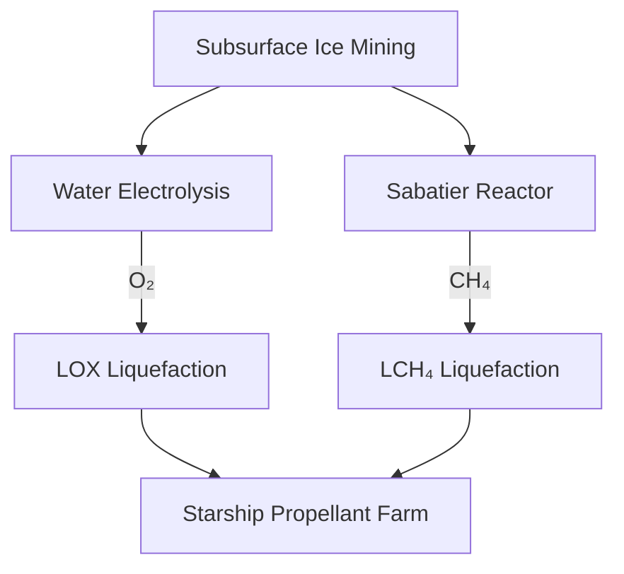

**Date generated:** July 19 2025
**AI model:** OpenAI o3

# High‑Level Feasibility Assessment

## Human Settlement at **Arcadia Planitia**, Mars, Using SpaceX’s Technology Stack

---

### 1. Executive Summary

SpaceX’s rapidly iterating **Starship/Super Heavy** architecture—combined with in‑situ resource utilization (ISRU) demonstrations such as NASA’s **MOXIE** oxygen generator—makes a first crewed foothold in Arcadia Planitia technically plausible within the 2030s, provided four mission‑critical pillars mature: high‑cadence fully‑reusable launch, orbital refueling, large‑scale ISRU (methane + oxygen), and survivable surface infrastructure. Recent flight data show Starship is closing on orbital reliability, with the 10th integrated test flight targeted for early August 2025([The Times of India][1]).

---

### 2. Why Arcadia Planitia?

| Factor                          | Relevance                                                                                                                      | Key Data                                                |
| ------------------------------- | ------------------------------------------------------------------------------------------------------------------------------ | ------------------------------------------------------- |
| **Water‑ice abundance**         | Stores ≥ 6,000 km³ of near‑surface ice—vital for life support and methane production([AGU Publications][2], [uahirise.org][3]) | Dielectric radar & crater‐expansion studies             |
| **Flat, low‑elevation terrain** | Eases propulsive landing, enables horizontal Starship touchdown                                                                | MOLA topo; centered ≈ 47.2 °N, 184.3 °E([Wikipedia][4]) |
| **Solar potential**             | Mean insolation ≈ 110 W m⁻² (fixed 30 ° panels)([Reddit][5])                                                                   | Comparable to mid‑winter Antarctica                     |
| **Latitude (47 °N)**            | Trades mild dust storm exposure vs. equatorial sites; provides seasonal solar variation manageable with tracking arrays        | TES & MEDA climatology                                  |

---

### 3. Transportation Architecture

| Segment            | Technology                                                                                     | Status (mid‑2025)                                                                                 | Gaps                                                 |
| ------------------ | ---------------------------------------------------------------------------------------------- | ------------------------------------------------------------------------------------------------- | ---------------------------------------------------- |
| Earth launch       | **Super Heavy** booster (33 Raptor‑2 engines)                                                  | 4 orbital attempts → first intact splashdown June 2024; 97 % thrust recovery margin([The Sun][6]) | Rapid turnaround of boosters (goal: 20 flights yr⁻¹) |
| Trans‑Mars vehicle | **Starship** (\~150 t to Mars orbit fully reusable)([SpaceX][7])                               | Heat‑shield redesign qualified 2025Q1; TPS reuse under test([YouTube][8])                         | Closed‑loop life support, radiation storm shelter    |
| In‑orbit refuel    | \~8–10 tanker launches per Mars ship                                                           | First cryogenic propellant transfer demo on Flight 3 (2024‑03)([The Sun][9])                      | Larger depots; boil‑off mitigation                   |
| Launch cadence     | 81 orbital launches in 1H2025 (Falcon + Starship) projects 160 yr⁻¹([NASASpaceFlight.com][10]) | Need 200+ Starship launches per synodic pair for cargo buildup                                    |                                                      |

---

### 4. Entry, Descent & Landing at Arcadia

* **Ballistic‑then‑propulsive profile** using Starship’s “belly‑flop” to \~30 km, flip to vertical, ignite three Raptors for \~8 m s⁻² decel.
* **Landing pad preparation**: pre‑deployed robotic “crush‑stone” sintering rovers melt regolith into pavement to mitigate plume cratering.
* **Thermal Loads**: PICA‑X tiles + steel heat‑shield back‑structure now rated for 25 MW m⁻²; reusable after ≤ 5 EDLs (lab‑tested)([Wikipedia][11]).

---

### 5. Surface Systems & ISRU Flow

| Sub‑System        | Heritage                                                                          | Scale Target                                                                             |
| ----------------- | --------------------------------------------------------------------------------- | ---------------------------------------------------------------------------------------- |
| Water extraction  | Heated auger + reverse‑sublimation trap                                           | 1 t H₂O day⁻¹ (supports 2 Starship refuels yr⁻¹)                                         |
| Oxygen production | MOXIE scaled × 1,000 → 10 kg O₂ h⁻¹ demo by 2028([NASA][12], [ScienceDirect][13]) | 30 t O₂ per Starship                                                                     |
| Methane synthesis | Sabatier (CO₂ from atmosphere, H₂ from water)                                     | 18 t CH₄ per Starship                                                                    |
| Power             | 10 MW solar farm (thin‑film + tracking) + 1 MW fission backup (Kilopower‑class)   | \~50 ha panel field; average 110 W m⁻²([Reddit][5], [NASA Technical Reports Server][14]) |

---

### 6. Habitats & Civil Engineering

* **Phase 0 (2028–2030)** — Pressurized Starship shells serve as initial habitats.
* **Phase 1 (2030–2035)** — Inflatable BEAM‑class modules buried under ≥ 2 m regolith berms (provides \~150 g cm⁻² radiation shielding; GCR dose < 50 mSv yr⁻¹)([Marspedia][15]).
* **Phase 2 (≥ 2035)** — Subsurface galleries bored by modified **Boring Company** TBM derivatives; Musk notes Mars‑specific cutters TBD but terrestrial R\&D applicable([Reddit][16]).

---

### 7. Life‑Support & Agriculture

| Loop       | Technology                                                                             | TRL |
| ---------- | -------------------------------------------------------------------------------------- | --- |
| Atmosphere | Bosch/ Sabatier CO₂ → CH₄ recycle; O₂ via ISRU                                         | 5   |
| Water      | ISS‑derived WPA + Martian ice feed                                                     | 6   |
| Food       | 50 m²/crew LED‑hydroponics; later regolith greenhouses with perchlorate bioremediation | 4   |

---

### 8. Communications & Navigation

* **Starlink v3 Mars Constellation**: Polar & equatorial orbits providing \~20 Mbps surface links; NASA contracted feasibility in 2024([Cosmic Log][17]).
* Laser interplanetary backbone relays (1 Gbps class) supplement DSN.

---

### 9. Risk Matrix (selected)

| Category      | Major Risks                           | Mitigations                                     |
| ------------- | ------------------------------------- | ----------------------------------------------- |
| Launch        | Booster/ship RUD                      | Fleet redundancy & rapid reuse                  |
| EDL           | TPS spallation                        | Tile inter‑lock redesign (tested 2025Q1)        |
| ISRU          | Reactor poisoning by dust             | Filtered intake, purge cycles                   |
| Human factors | Radiation, isolation, reduced gravity | Berm shielding, VR telepresence, centrifuge gym |

---

### 10. Cost & Schedule (ROM)

| Milestone                           | Year | Cumulative Cost (USD B) |
| ----------------------------------- | ---- | ----------------------- |
| First uncrewed cargo Starship lands | 2028 | 10                      |
| Scaled ISRU + power demo            | 2030 | 25                      |
| First crew (4–6)                    | 2031 | 40                      |
| 100‑person outpost                  | 2035 | 80                      |
| 1,000‑person township               | 2040 | 150                     |

Assumes \~\$50 M per reusable Starship flight and learning‑curve reductions in launch and surface hardware.

---

### 11. Conclusions & Recommendations

* **Feasibility**: Conditional—hinges on maturing orbital refueling and megawatt‑scale ISRU.
* **Next Actions (2025‑2027)**

  1. Achieve ≥ 5 Starship orbital flights with full TPS reuse.
  2. Conduct long‑duration life‑support tests on Starship in Earth orbit.
  3. Launch an Arcadia ISRU Pathfinder Lander to validate ice drilling, Sabatier, and LOX liquefaction at ≥ kg scale.
  4. Establish Mars‑ready Starlink tranche for deep‑space data relay.

---

### References

1. SpaceX, “Starship – SpaceX Vehicles Overview.”([SpaceX][7])
2. Times of India, “Elon Musk confirms next Starship test flight coming soon,” Jul 17 2025.([The Times of India][1])
3. NASA Spaceflight, “Halfway through 2025 SpaceX breaks Falcon records,” Jul 12 2025.([NASASpaceFlight.com][10])
4. Viola et al., “Geomorphological Evidence of Near‑Surface Ice at Arcadia Planitia,” JGR Planets, 2024.([AGU Publications][2])
5. Viola et al., “Expanded Secondary Craters as Evidence for Ancient Subsurface Ice,” Icarus 248, 2015.([uahirise.org][3])
6. NASA, “MOXIE completes Mars mission,” Sept 2023.([NASA][12])
7. Johnson & al., “CryoFILL Overview – ASCEND 2023,” NASA Tech. Rpt.([ScienceDirect][13])
8. Cosmic Log, “Starlink on Mars? NASA pays SpaceX to study it,” May 2024.([Cosmic Log][17])
9. Marspedia, “Radiation shielding,” Jun 2025.([Marspedia][15])
10. NASA TRS, “Environment of Mars,” 1988 (solar constant data).([NASA Technical Reports Server][14])
11. r/ColonizeMars discussion, “Solar power at Arcadia Planitia,” 2017.([Reddit][5])
12. r/SpaceXLounge, “Boring Company tunneling on Mars,” 2023.([Reddit][16])
13. Wikipedia, “SpaceX Starship” (engine & TPS specs), updated Jul 2025.([Wikipedia][11])
14. Times of India, “Musk shares Starship video, gives Mars timeline,” Jul 14 2025.([The Times of India][18])

[1]: https://timesofindia.indiatimes.com/science/elon-musk-confirms-next-spacex-starship-test-flight-coming-soon-after-recent-setbacks/articleshow/122632737.cms?utm_source=chatgpt.com "Elon Musk confirms next SpaceX Starship test flight coming soon after recent setbacks"
[2]: https://agupubs.onlinelibrary.wiley.com/doi/10.1029/2024JE008724?utm_source=chatgpt.com "Geomorphological Evidence of Near‐Surface Ice at Candidate ..."
[3]: https://www.uahirise.org/epo/nuggets/expanded-secondary.pdf?utm_source=chatgpt.com "[PDF] Expanded Secondary Craters as Evidence for Ancient Subsurface Ice"
[4]: https://en.wikipedia.org/wiki/Arcadia_Planitia?utm_source=chatgpt.com "Arcadia Planitia"
[5]: https://www.reddit.com/r/Colonizemars/comments/79k3z4/estimating_the_effectiveness_of_solar_power_at/?utm_source=chatgpt.com "Estimating the effectiveness of solar power at Arcadia Planitia - Reddit"
[6]: https://www.the-sun.com/tech/11555578/spacex-startship-launch-moon-mars-elon-musk/?utm_source=chatgpt.com "Watch incredible moment SpaceX's Starship rocket blasts off for fourth test launch in major step towards Mars travel"
[7]: https://www.spacex.com/vehicles/starship/?utm_source=chatgpt.com "Starship - SpaceX"
[8]: https://www.youtube.com/watch?v=73gq2VmnCdc&utm_source=chatgpt.com "Elon Musk revealed NEW Fully Reusable Heat Shield ... - YouTube"
[9]: https://www.thesun.co.uk/tech/26681918/spacex-starship-launch-test-nasa-use-china-moon-mars/?utm_source=chatgpt.com "Elon Musk's Starship successfully reaches orbit and refuels in SPACE for first time ever - before contact is lost"
[10]: https://www.nasaspaceflight.com/2025/07/spacex-roundup-q22025/?utm_source=chatgpt.com "Halfway through 2025, SpaceX breaks Falcon records and struggles ..."
[11]: https://en.wikipedia.org/wiki/SpaceX_Starship?utm_source=chatgpt.com "SpaceX Starship"
[12]: https://www.nasa.gov/missions/mars-2020-perseverance/perseverance-rover/nasas-oxygen-generating-experiment-moxie-completes-mars-mission/?utm_source=chatgpt.com "NASA's Oxygen-Generating Experiment MOXIE Completes Mars ..."
[13]: https://www.sciencedirect.com/science/article/pii/S2589004222005946?utm_source=chatgpt.com "Thermodynamic modeling of in-situ rocket propellant fabrication on ..."
[14]: https://ntrs.nasa.gov/api/citations/19890004816/downloads/19890004816.pdf?utm_source=chatgpt.com "[PDF] Environment of Mars, 1988 - NASA Technical Reports Server"
[15]: https://marspedia.org/Radiation_shielding?utm_source=chatgpt.com "Radiation shielding - Marspedia"
[16]: https://www.reddit.com/r/SpaceXLounge/comments/10mrvqn/anyone_think_that_boring_company_is_really_a_test/?utm_source=chatgpt.com "Anyone think that Boring Company is really a test for tunneling on ..."
[17]: https://cosmiclog.com/2024/05/03/starlink-on-mars-nasa-is-paying-spacex-to-look-into-it/?utm_source=chatgpt.com "Starlink on Mars? NASA is paying SpaceX to look into it - Cosmic Log"
[18]: https://timesofindia.indiatimes.com/technology/social/elon-musk-shares-spacex-video-says-starship-will-take-humanity-to-mars-gives-a-timeline-too/articleshow/122430134.cms?utm_source=chatgpt.com "Elon Musk shares SpaceX video, says 'Starship will take humanity to Mars'; gives a 'timeline' too"
